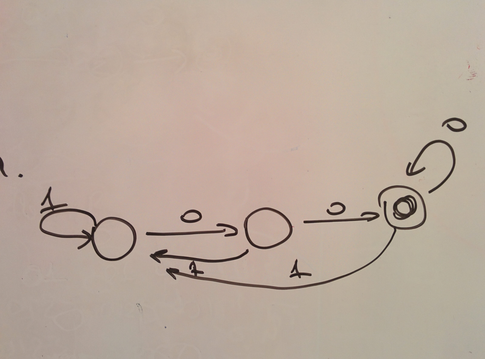
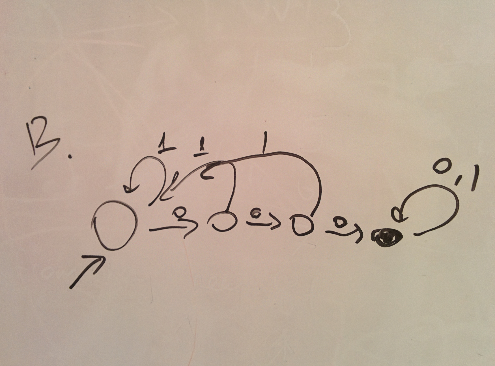
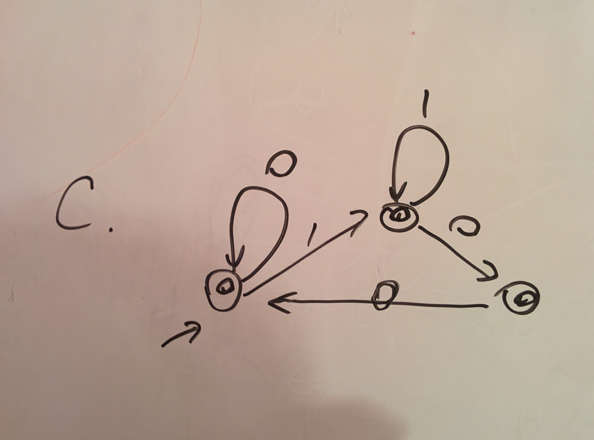
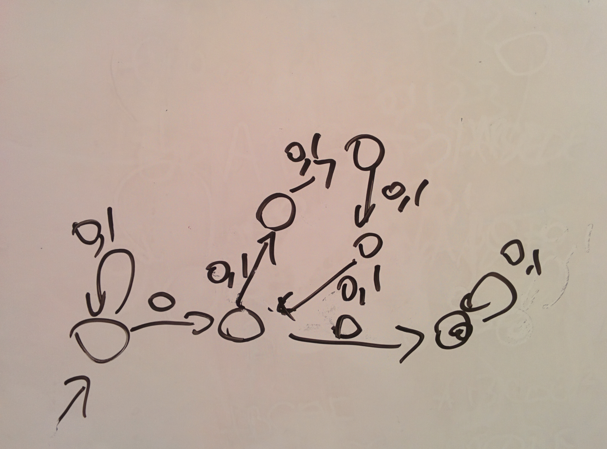

# Written Assignment 1

1.
  a. `.*00`
  b. `.*000.*`
  c. `0*(1*00+)*1*0*`

2. see attachments





3. Any number of zeroes followed by any number of ones. `0*1*`.

4. see attachment. Less than `2^6`



5.
  a. `w*z?((y+x?)(w+z?))*y*x?`
  b. `y*x*`

6. Didn't actually code it, just copied from solutions. (shame on me)

```
-- A is both the stationary particle and the implementation of our linked
-- list that holds particles
-- Particles read their state from the input during initialization and
-- support three methods:
-- set_next(newnext) - mutator for next pointer to connect up list
-- do_step(deltat) - simulates a timestep for list reachable from self
-- print() - prints out list (in reverse order)
class A inherits IO {
  position : Int <- in_int();
  next : A;
  set_next(newnext : A) : SELF_TYPE { { next <- newnext; self; } };
  do_step(deltat : Int) : Object {
    -- no change to us - just go on to next in list
    if isvoid next then self else next.do_step(deltat) fi
  };
  print() : Object { {
    -- print rest of list first
    if isvoid(next) then self else next.print() fi;
    out_string(type_name()); out_string("\n");
    out_int(position);       out_string("\n");
  } };
};

-- B gets nearly all its functionality from A - it just needs to read/write
-- velocity, and use that to update position on time steps
class B inherits A {
  velocity : Int <- in_int();
  do_step(deltat : Int) : Object { {
    -- update position and then let A.do_step to the rest
    position <- position + velocity * deltat;
    self@A.do_step(deltat);
  } };
  print() : Object { {
    -- print rest of list and first part of self with A.print
    self@A.print();
    out_int(velocity); out_string("\n");
  } };
};

-- C gets nearly all its functionality from B - it just needs to read/write
-- acceleration, and use that to update velocity on time steps
class C inherits B {
  accel : Int <- in_int();
  do_step(deltat : Int) : Object { {
    -- update velocity and then let B.do_step to the rest
    velocity <- velocity + accel * deltat;
    self@B.do_step(deltat);
  } };
  print() : Object { {
    -- print rest of list and first part of self with B.print
    self@B.print();
    out_int(accel); out_string("\n");
  } };
};

class Main inherits IO {
  main() : Object {
    let particles : A, deltat : Int, loops : Int in {
    -- read particles
    let s : String <- in_string() in
    while not(s = "X") loop {
      -- create new particle and add to *front* of list
      let p : A <- if (s = "A") then new A else
                   if (s = "B") then new B else
                                     new C fi fi in

      particles <- p.set_next(particles);
      -- read next string
      s <- in_string();
    } pool;

    -- simulation loop
    deltat <- in_int();
    loops <- in_int();
    let i : Int in
      while i < loops loop {
        particles.do_step(deltat);
        i <- i + 1;
      } pool;
      -- write results
      particles.print();
      out_string("X\n"); -- end of particles flag
      out_int(deltat); out_string("\n");
      out_int(loops); out_string("\n");
    }
  };
};
```

